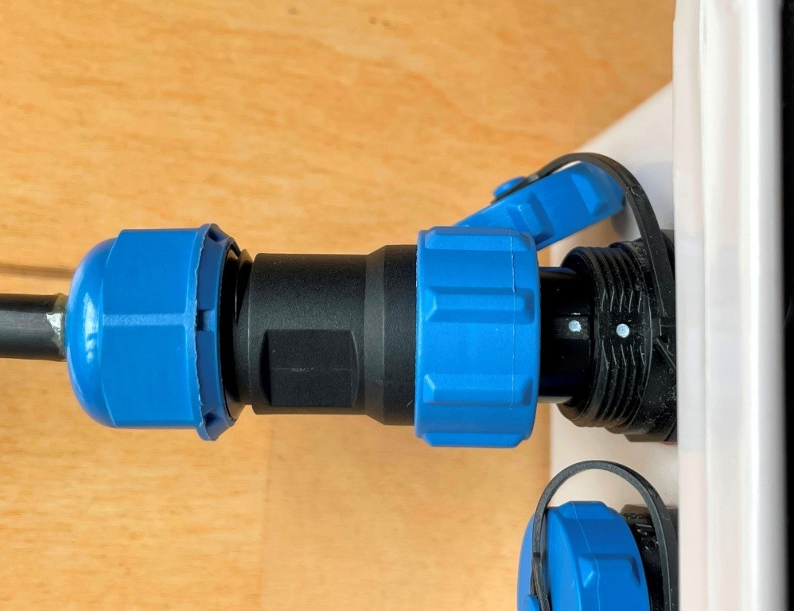
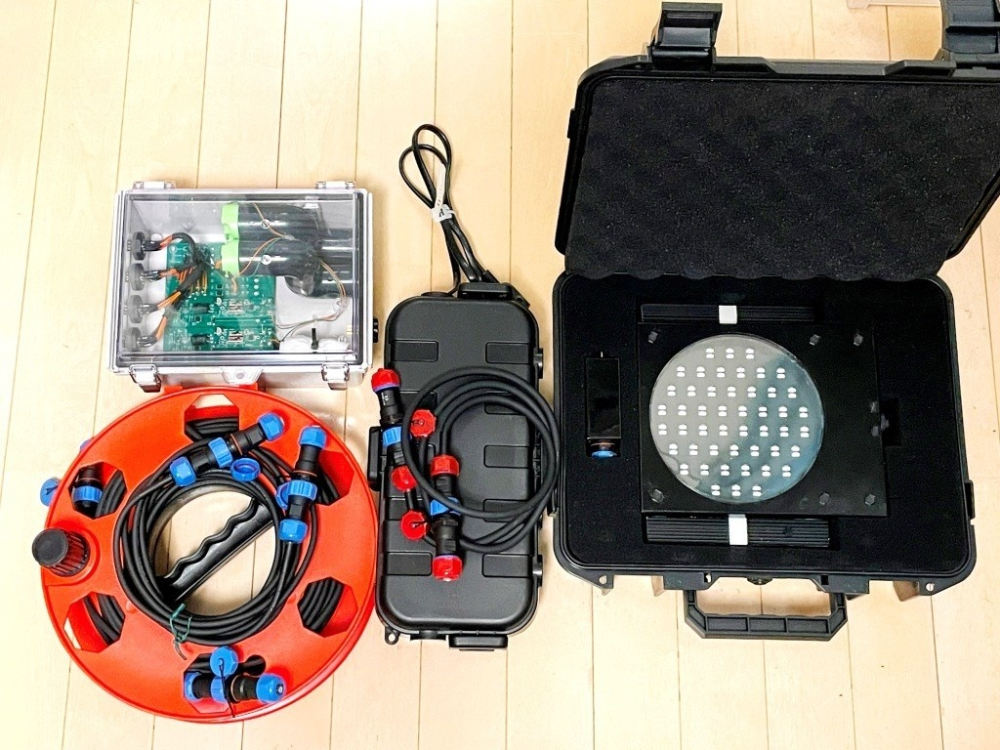
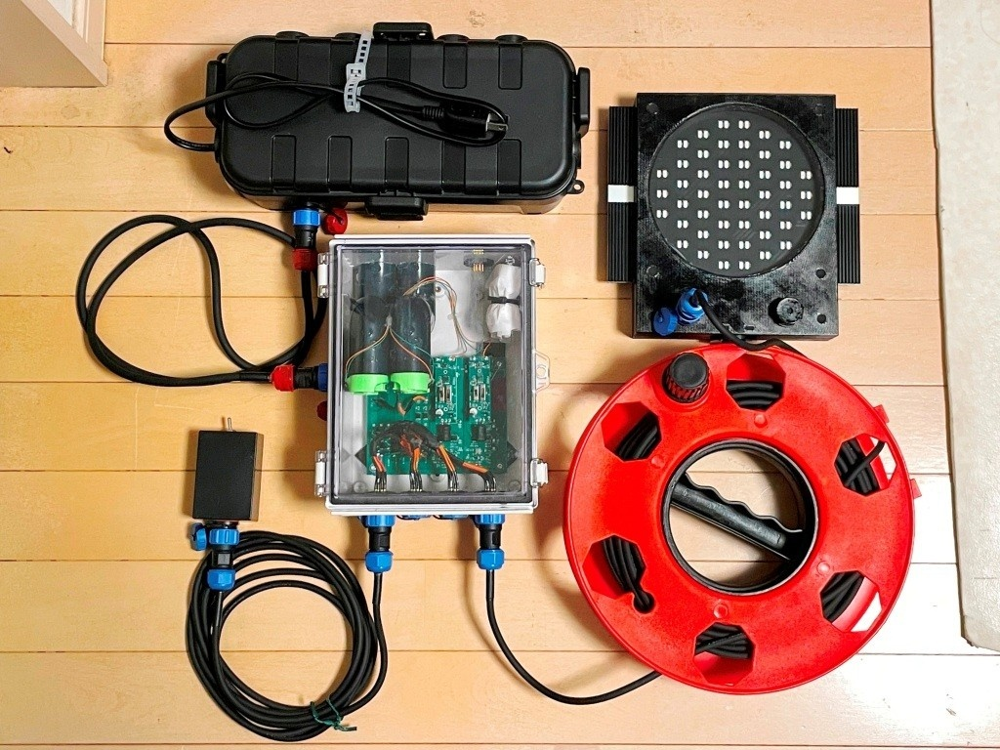
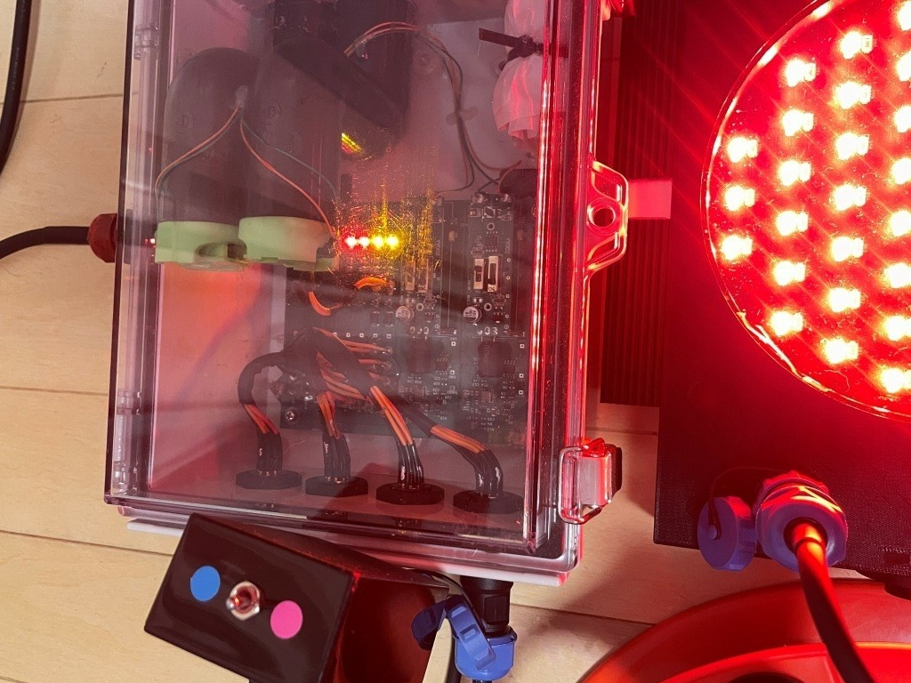
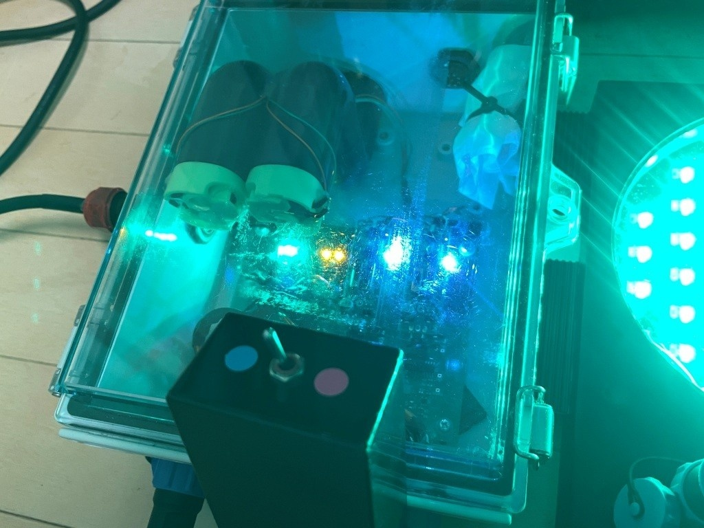
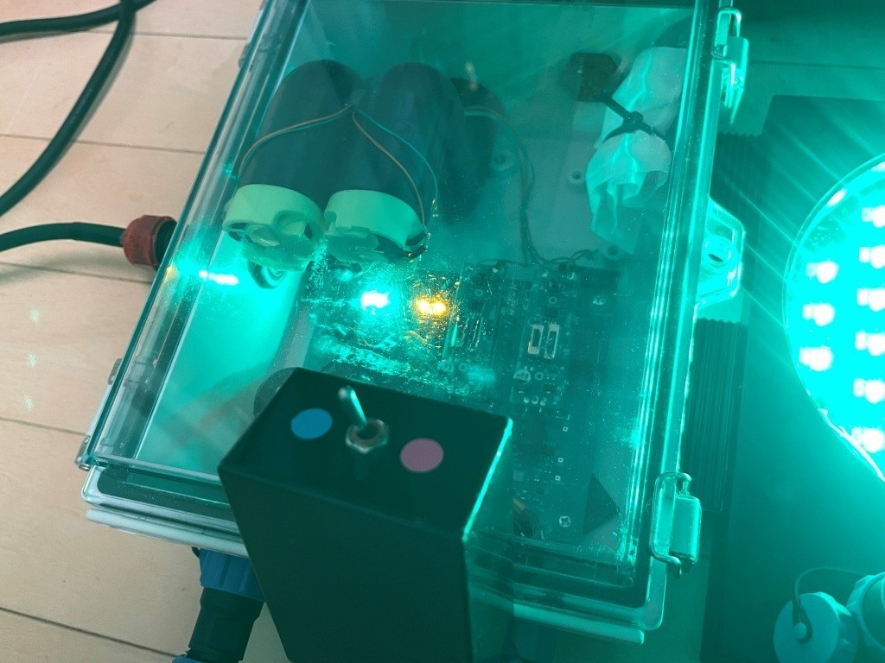
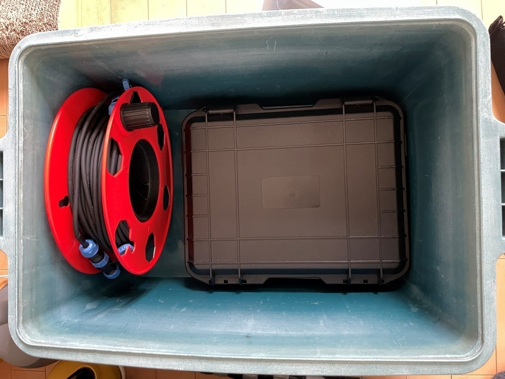
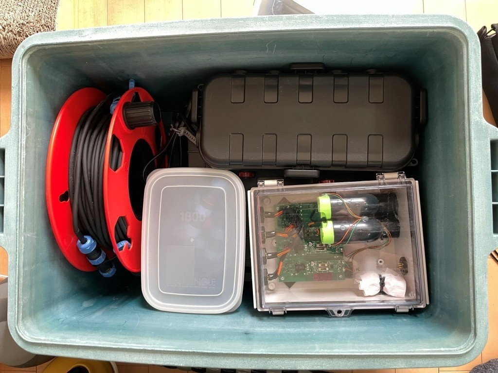
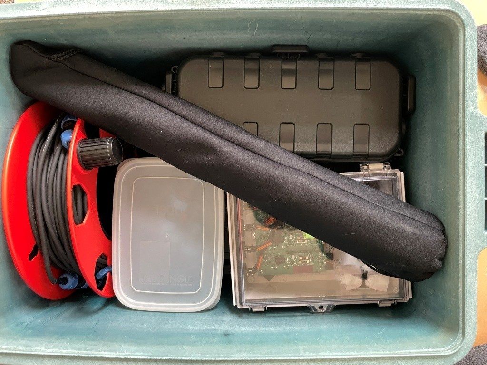

# シクロクロス用信号機の取扱説明書

## 1. 注意点

### ● コネクタの差し込み方

白い点を合わせて奥まで差し込む。

カップリングナット（抜け止め用ナット）を**締めるときは指先で軽く回すこと**。軽く回らない場合は正しく勘合していないのでやり直してください。

### ● ケーブルを踏まないで下さい。

### ● 取り外したときはキャップをかぶせてください。

### ● キャップでコネクタを保護した状態で水洗い可能です。

水洗いの前にキャップが取り付けられているか確認してください。

## 2. 接続

### 構成部品

### 接続状態

赤のコネクタは赤のソケットに、青のコネクタは青のソケットにさしてください。ホイッスル用の透明な箱に４つ青のコネクタがありますが、刺す場所はどこでも大丈夫です。

## 3. 動作確認

### 赤点灯

スイッチを赤側にして、ACコンセントを差し込むと、

- オレンジ：２つ点灯（電源が供給されていると点灯）
- 赤：２つ点灯（スイッチが赤の側で点灯）

### 緑点灯

スイッチを青側にすると、

- 緑（上）：２つ点灯（スイッチが緑側）
- 白（下）：２つ点灯（ホイッスル発音中）

### 緑点灯（制御箱）

スイッチを青側にして２秒後

- 白（下）：消灯（ホイッスル自動停止）

## 4. 収納

### リールとハードキャリングケース

### タッパ、ホイッスルケース、電源ケース

### 一脚

